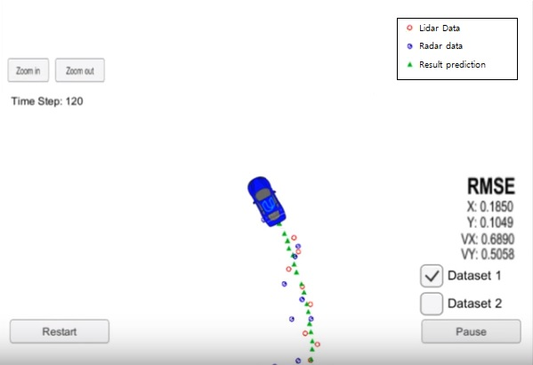

## Unscented Kalman Filter Project

Overview
---

Project #6 from the Udacity Self-Driving Car program (SDC). This project is part of the Sensor Fusion content in which sensor data received from a Lidar and a Radar is processed according to its type by the same algorithm. Unlike the Extended Kalman Filter, the Unscented Kalman Filter (UKF) uses a creative way to deal with non-linearities by using Sigma points.
Sigma point basically attempt to model non-linearities to better approximate the behavior of the tracked object.

Tools and Techniques:
---

* Implementd in C++
* Sensor Fusion techniques
* Simulator* for results visualization

Reflections:
---

UKF better aproximates the results compared to a regular Kalman Filter, particularly when the object is moving in a curved trajectory.

Sigma point approach is mathematically complex and not easy to understand, however, with some assumptions is possible to deploy a working model even for inexperenced programmers.

Finally, both UKF and EKF projects track a single object at a time, this is good for learning purposes, but one can imagine that in a real implementation would need a much more sophisticated system able to track everythy important detail in the surroundings, including other cars, pedestrians etc.